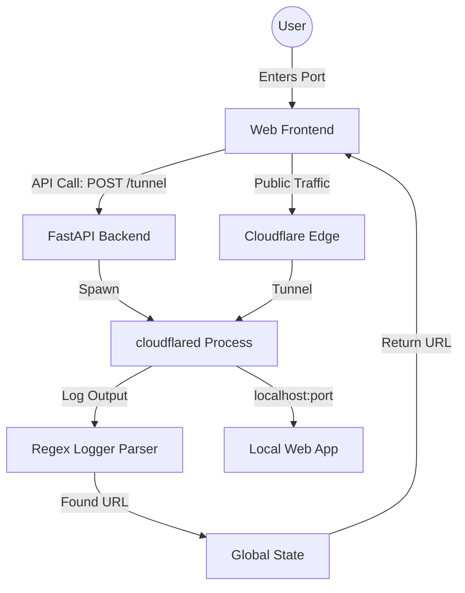

# Cloudflare Tunnel Manager - System Design & Flow

## Project Goal
The system is designed as a **Tunnel Manager (Control Layer)** that securely exposes isolated local applications (**Target Services**) to the internet. By aligning with real-world development workflows, this setup drastically reduces deployment overhead, allowing developers to share live environments and enable faster collaboration instantly.

### Key Objectives:
- **Separation of Concerns**: The FastAPI-based manager operates efficiently on a dedicated port (e.g., 1231) providing APIs and a web interface, while a sample target service runs independently on another port (e.g., 3000).
- **Automation**: Once a tunnel is requested, the manager programmatically launches a cloudflared process to create a secure public URL pointing explicitly to the Target Service.
- **Non-Blocking Execution**: The manager utilizes asynchronous subprocess handling to parse tunnel logs and extract the `.trycloudflare.com` URL. This prevents blocking of the FastAPI event loop and enables concurrent request handling, ensuring a scalable design where the control layer remains highly responsive to multiple API requests.
- **Visibility**: Provide real-time updates on tunnel status, generated public URLs, and active port mappings.

---

## System Architecture

The project follows an architecture centered around a separated **Control Layer** managing a **Target Service**:

### 1. Control Layer: Frontend (Web GUI)
- **Role**: 
    - Provides the user interface to manage tunnels.
    - Accepts user input for the **Target Service** port.
    - Communicates with the Control Layer Backend API.
    - Displays the public URL and real-time status dynamically.

### 2. Control Layer: Backend (FastAPI Manager)
- **Role**:
    - **API Provider**: Exposes endpoints (`/api/tunnel`, `/api/status`) to manage the tunnel lifecycle independently of the target app.
    - **Process Manager**: Spawns and gracefully kills cloudflared as a background subprocess, creating a secure public URL pointing exclusively to the Target Service.
    - **Log Parser**: Asynchronously monitors the output of cloudflared using regex to extract the ephemeral Cloudflare domain.

### 3. Target Service (Local Application)
- **Role**:
    - The actual backend or web application under development.
    - Runs independently on a separate port (e.g., 3000).
    - Unaware of the Cloudflare tunnel; it simply receives traffic routed by cloudflared.

---

## Project Flow

The following sequence outlines the operational flow of the application:

### Step 1: Initialization
The FastAPI server is started, serving the static frontend files from the `/static` directory.

### Step 2: Requesting a Tunnel
1. The user enters a **Port Number** (e.g., `3000`) in the web interface.
2. The frontend sends a `POST` request to `/api/tunnel` with the payload `{"port": 3000}`.

### Step 3: Tunnel Execution
1. The backend initiates a subprocess: `cloudflared tunnel --url http://localhost:3000`.
2. A background `asyncio` task is launched to asynchronously read the **stderr** stream of this process.
3. The backend uses a regular expression `https://[a-zA-Z0-9-]+\.trycloudflare\.com` to scan the logs for the public URL.

### Step 4: URL Delivery
1. Once the URL is found, it is saved in the global `state`.
2. The initial `POST` request (which awaits tunnel initialization) returns the URL to the frontend.
3. If the URL isn't found within a timeout, the backend returns a "starting" status, and the frontend begins polling.

### Step 5: Monitoring & Usage
1. The frontend displays the public link to the user.
2. The frontend periodically polls `/api/status` to check if the cloudflared process is still running.

### Step 6: Termination
1. The user clicks "Stop Tunnel".
2. The frontend sends a `DELETE` request to `/api/tunnel`.
3. The backend sends a `SIGTERM` (graceful shutdown) or `SIGKILL` to the cloudflared process and clears the global state.

---

## Real-World Use Cases
- **API Testing**: Securely expose local endpoints to external applications, APIs, or mobile clients during development.
- **Webhook Integrations**: Receive and debug incoming webhooks from external services (e.g., Stripe, GitHub, Slack) directly on a local development machine.
- **Remote Collaboration**: Share live functional environments instantly with teammates or clients for immediate review and feedback, bypassing the overhead of staging deployments.

---

## Component Diagram (High-Level)

